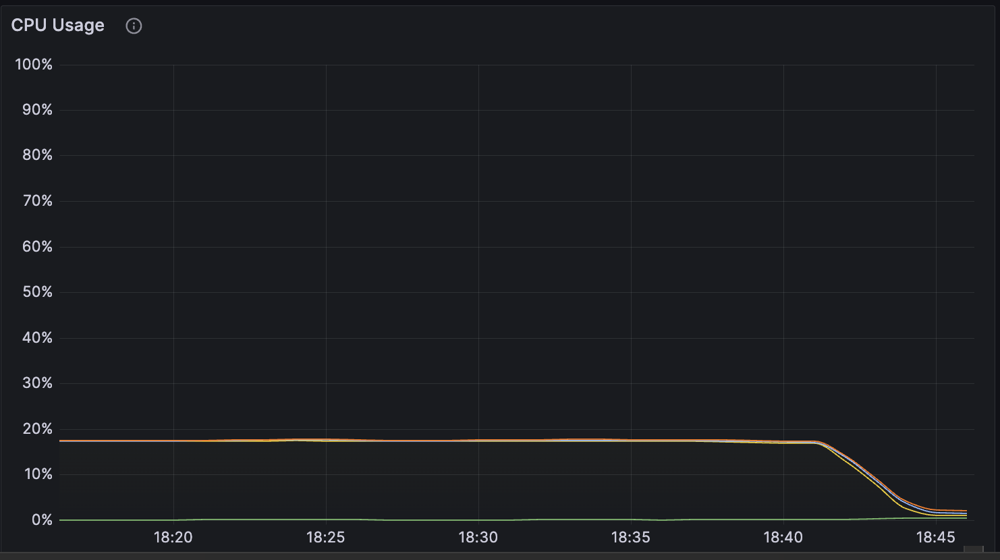

+++
title = 'N100 Mini PC homeserver build'
date = 2023-10-01T11:17:14+02:00
draft = false
author = 'Pascal'
+++



A few years ago I got into the home server building habbit. I started with a typical
tower PC during my student years but after moving around a lot, needed something more
portable. As energy efficiency was also a criteria for me, I decided to build everything
based on a RPI setup. It turned out I could run most of my needs back then on a RPI 4
with 4GB of ram. 

Several years have gone by and my RPI + USB-C 4 Disk JBOD array have served me well. I have
been using MergerFS + SnapRaid for a few years now and recently also migrated the Pi away
from Debian to my personal favorite OS, Arch Linux (more precisely Manjaro ARM).
However, the capacity of the Pi is now reaching its limits and I started looking towards
a more capable replacement. I wanted to keep the energy efficiency and portability of the
Pi, but also wanted to have more CPU power and RAM. I also wanted to keep the JBOD array,
as I have been very happy with it. 

I do believe the vast majority of households would be completely fine with the setup I am
about to describe below.  It can easily handle several movie streams, run an entire home
automation stack and even act as a storage server for security cameras. 

I recently moved to a city with 1Gbit symmetric fiber internet, so I can also for the
first time consider hosting large data volume services such as a movie library or a
self-hosted Nextcloud + backup solution for phones and laptops. Of course I still need to
perform off-site backups of the most critical pieces of information, but in the case of a
catastrophic event in my apartment, I'll survive loosing my collection of Stargate SG1
episodes.

## Target Setup

I will remain minimalistic with my setup, relying on 3 core components:

- A N100 / 16GB DDR5 / 256GB SSD Mini PC
- My existing 4 bay 3.5" JBOD USB-C disk array connected via USB-C
- A remote backup location, e.g. backblaze

## Setting up

Unfortunately, the usual USB boot did not work as I had anticipated. For some reason, [as others had also shared online](https://www.reddit.com/r/buildapc/comments/v5sw9o/you_all_are_literally_my_last_hope_i_bought_a/), my mini PC too did not support USB booting for some obscure reason. 




It may have been the fact that I used an SSD as a boot device but ultimately, it was all I had so I looked into [PXE](https://wiki.archlinux.org/title/Preboot_Execution_Environment). Turns out there is an awesome project [netboot](https://netboot.xyz/docs/kb/networking/edgerouter) which allows you to boot into a PXE environment. I went ahead and set up a PXE host on my EdgeRouter and was able to boot into the netboot environment. Bonus points for being able to boot into a variety of OSes, including Arch Linux for any machine I may need to install in the future.

### Netboot

To enable netboot I rand the below:

```bash
# run on my edge router to set up
sudo mkdir /config/user-data/tftproot
sudo chmod ugo+rX /config/user-data/tftproot

configure

set service dns forwarding  options enable-tftp
set service dns forwarding  options tftp-root=/config/user-data/tftproot

commit
save

# download the netboot files
sudo curl -o /config/user-data/tftproot/netboot.xyz.efi https://boot.netboot.xyz/ipxe/netboot.xyz.efi
sudo chmod ugo+r /config/user-data/tftproot/netboot.xyz.efi

# configure the bootfile configs
configure

set service dhcp-server global-parameters "option client-arch code 93 = unsigned integer 16;"
edit service dhcp-server shared-network-name LAN subnet 192.168.1.0/24
set bootfile-server 192.168.1.1
set bootfile-name netboot.xyz.efi

commit
save
```




### Setup of Arch Linux

Because Netboot doesn't offer Manjaro, I simply installed Arch instead. Ultimately, all I need is an arch base with `yay`. 
For that I followed the [arch installation guide](https://wiki.archlinux.org/title/Installation_guide)



The high level steps were:

1. [partitioning](https://wiki.archlinux.org/title/Installation_guide#Partition_the_disks)
2. [users & groups](https://wiki.archlinux.org/title/General_recommendations#Users_and_groups)
3. [setting up ssh](https://wiki.archlinux.org/title/Secure_Shell)
4. [installing NetworkManager](https://wiki.archlinux.org/title/NetworkManager)
5. Setting a static IP in my router

### Installing standard libraries
After a reboot, I could get started setting up the machine. 
I happened to have an existing script lying around from a while ago which ought to bootstrap my machines. This was written for debian and was meant mostly to get me set up on numerous cloud instances. However, that was based on apt & brew so a lot of tweaks were necessary since manjaro with its `yay` package manager is much easier to set up. 

```bash
# install core requirements
yay -Syu tmux htop bmon fzf wget curl stow ranger dust duf tig fd lsd docker-compose docker python github-cli inetutils bottom tldr exa dust jq dog fuse2 hd-idle-go

```

```bash
# get dotfiles mounted
git clone https://github.com/pascalwhoop/dotfiles
cd dotfiles
# stow all the things
cat linux.stows | xargs -I {} stow -t ~ {}

mkdir -p code/
cd code/
# set up private SSH key for Github
gh auth login
git clone https://github.com/pascalwhoop/dotfiles_private
cd dotfiles_private
# stow all the things
cat linux.stows | xargs -I {} stow -t ~ {}
```


```bash
# set up fish
yay -S fish 
# oh my fish
curl https://raw.githubusercontent.com/oh-my-fish/oh-my-fish/master/bin/install | fish
```

### Setting up MergerFS and SnapRaid

Setting up my existing disks was again really simple. Copy over the fstab and snapraid config and I was good to go. 

```bash
mkdir -p /mnt/mergerdisk{1,2,3} /mnt/parity1 /mnt/vault
cp pascalwhoop@pi:/etc/fstab /etc/fstab
systemctl daemon-reload
mount -a
cp /mnt/vault/Backup/Raspberry/etc/snapraid.conf /etc/snapraid.conf
```

```
sudo mergerfs -o category.create=mfs,nonempty,defaults,allow_other,minfreespace=50G,fsname=mergerfs /mnt/mergerdisk1:/mnt/mergerdisk2:/mnt/mergerdisk3 /mnt/vault
# Static information about the filesystems.
# See fstab(5) for details.

# <file system> <dir> <type> <options> <dump> <pass>
# /dev/sda2
UUID=26f131a3-5a54-4260-ad2d-d16c09f7893e	/         	ext4      	rw,relatime	0 1

#mergerfs setup
UUID=fb91d7ff-088f-49ed-a191-892fcf204823 	/mnt/mergerdisk1    	ext4    	defaults,nofail 0 0
UUID=38010ff4-0ab9-45b0-a1cd-b43b2df6ecf4 	/mnt/mergerdisk2    	ext4    	defaults,nofail 0 0
UUID=03234061-ec5f-417a-8140-5ed8587e2ae5 	/mnt/mergerdisk3    	ext4    	defaults,nofail 0 0
#parity
UUID=e311ff2f-0937-44c6-99d2-225ab626f7d6 	/mnt/parity1        	ext4    	defaults,nofail 0 0

# merging 3 disks into 1 virtual FS
#/mnt/mergerdisk1:/mnt/mergerdisk2:/mnt/mergerdisk3	/mnt/vault     		fuse.mergerfs 	category.create=mfs,nonempty,nofail,defaults,allow_other,minfreespace=50G,fsname=mergerfs 0 0
/mnt/mergerdisk*	/mnt/vault     		fuse.mergerfs 	category.create=mfs,cache.files=partial,dropcacheonclose=true,nonempty,nofail,defaults,allow_other,minfreespace=50G,fsname=mergerfs 0 0
#/mnt/mergerdisk*	/mnt/vault     		fuse.mergerfs 	category.create=mfs 0 0
```



As a few days before my new Mini PC arrived, I also got 2x4TB 2.5inch disks from my dad
that he had lying around, I also decided to upgrade from 4x2TB to 4x4TB.  I therefore
went to [this comparison
website](https://geizhals.eu/?cat=hde7s&sort=r&xf=3263_3%7E8457_Conventional+Magnetic+Recording+(CMR)%7E958_4000)
(German) and filtered for low idle power disks. The most efficient 4TB+ disk with
non-shingled recording was the [Seagate SkyHawk +Rescue
4TB](https://geizhals.eu/seagate-skyhawk-rescue-4tb-st4000vx016-a2677177.html)



Before the expansion: 

```
⋊> pascalwhoop@homeserver ⋊> /e/systemd duf
╭────────────────────────────────────────────────────────────────────────────────────────────────╮
│ 5 local devices                                                                                │
├──────────────────┬────────┬───────┬────────┬───────────────────────────────┬──────┬────────────┤
│ MOUNTED ON       │   SIZE │  USED │  AVAIL │              USE%             │ TYPE │ FILESYSTEM │
├──────────────────┼────────┼───────┼────────┼───────────────────────────────┼──────┼────────────┤
│ /                │ 232.7G │ 14.9G │ 205.9G │ [#...................]   6.4% │ ext4 │ /dev/sda2  $$│
│ /mnt/mergerdisk1 │   1.8T │  1.6T │  66.1G │ [##################..]  91.3% │ ext4 │ /dev/sde1  │
│ /mnt/mergerdisk2 │   1.8T │  1.7T │     0B │ [##################..]  94.9% │ ext4 │ /dev/sdc1  │
│ /mnt/mergerdisk3 │   1.8T │  1.7T │  42.3G │ [##################..]  92.6% │ ext4 │ /dev/sdd1  │$$
│ /mnt/parity1     │   1.8T │  1.8T │  44.5G │ [###################.]  97.6% │ ext4 │ /dev/sdb1  │
╰──────────────────┴────────┴───────┴────────┴───────────────────────────────┴──────┴────────────╯
```

After the expansion: 

```
⋊> pascalwhoop@homeserver ⋊> ~/c/curiloo.com on main ⨯ duf
╭──────────────────────────────────────────────────────────────────────────────────────────────────╮
│ 6 local devices                                                                                  │
├──────────────────┬─────────┬────────┬────────┬───────────────────────────────┬──────┬────────────┤
│ MOUNTED ON       │    SIZE │   USED │  AVAIL │              USE%             │ TYPE │ FILESYSTEM │
├──────────────────┼─────────┼────────┼────────┼───────────────────────────────┼──────┼────────────┤
│ /                │  232.7G │ 140.8G │  80.0G │ [############........]  60.5% │ ext4 │ /dev/sda2  │
│ /mnt/mergerdisk1 │    3.6T │   1.9T │   1.5T │ [##########..........]  51.9% │ ext4 │ /dev/sde1  │
│ /mnt/mergerdisk2 │    3.6T │   1.9T │   1.5T │ [##########..........]  52.5% │ ext4 │ /dev/sdb1  │
│ /mnt/mergerdisk3 │    3.6T │   1.9T │   1.5T │ [##########..........]  53.0% │ ext4 │ /dev/sdc1  │
│ /mnt/parity1     │    3.6T │   1.8T │   1.6T │ [#########...........]  49.6% │ ext4 │ /dev/sdd1  │
╰──────────────────┴─────────┴────────┴────────┴───────────────────────────────┴──────┴────────────╯
```

To transition between disks, I had to do a bit of a dance which took a few days. I could at most swap out 2 disks in any one go, 
since I needed to transfer all the data, meaning I needed both disks to be online at the same time. Also, while I could have done a
`dd` raw copy, I decided to do a file-system level copy to minimise issues with sector alignments. I wanted maximum performance out
of the new disks. 

So the steps were

1. insert 2 new disks, keep the most likely to fail ones in, 
2. `fdisk` creating partitions, `mkfs.ext4` formatting the partitions, mounting
3. perform an `rsync` from OLD to NEW (2 copies in parallel in a tmux with a `btm` monitoring the disk IO)
4. swap out UUID's in the fstab
5. repeat for the other 2 disks
6. re-mount the mergerfs disk
7. run a snapraid sync
8. run a full scrub

This took a few days but the result is ~ 4.5TB of fresh space. Of course an enterprise
setup would have required much less labor and no downtime, but it also would have cost me
a lot more hardware and energy consumption. 


### Spinning down disks on idle

As I had already installed `hd-idle-go` earlier, I was able to simply activate it by
editing the file `/etc/defaults/hd-idle` and setting `START_HD_IDLE=true`. 

```bash
sudo systemctl enable hd-idle --now
```

Now my disks spin down after 10 minutes which means most of the time, the disks only consume their standby power.


### Setting up Grafana monitoring

For monitoring I use Grafana. As such, I installed an agent and configured it to talk to
my grafana.com cloud instance. The point of monitoring is that an independent system
monitors my server. I chose to install the agent via `yay` instead of the bash command
because I prefer manage all my packages via the proper package manager.

``` bash
yay -S grafana-agent
```



{}
```yaml
integrations:
  prometheus_remote_write:
  - basic_auth:
      password: <<PASS>>
      username: 1011021
    url: https://prometheus-prod-01-eu-west-0.grafana.net/api/prom/push
  agent:
    enabled: true
    relabel_configs:
    - action: replace
      target_label: instance
      source_labels:
      - agent_hostname
    - action: replace
      target_label: job
      replacement: "integrations/agent-check"
    metric_relabel_configs:
    - action: keep
      regex: (prometheus_target_.*|prometheus_sd_discovered_targets|agent_build.*|agent_wal_samples_appended_total|process_start_time_seconds)
      source_labels:
      - __name__
  # Add here any snippet that belongs to the `integrations` section.
  # For a correct indentation, paste snippets copied from Grafana Cloud at the beginning of the line.
  node_exporter:
    enabled: true
    # disable unused collectors
    disable_collectors:
      - ipvs #high cardinality on kubelet
      - btrfs
      - infiniband
      - xfs
      - zfs
    # exclude dynamic interfaces
    netclass_ignored_devices: "^(veth.*|cali.*|[a-f0-9]{15})$"
    netdev_device_exclude: "^(veth.*|cali.*|[a-f0-9]{15})$"
    # disable tmpfs
    filesystem_fs_types_exclude: "^(autofs|binfmt_misc|bpf|cgroup2?|configfs|debugfs|devpts|devtmpfs|tmpfs|fusectl|hugetlbfs|iso9660|mqueue|nsfs|overlay|proc|procfs|pstore|rpc_pipefs|securityfs|selinuxfs|squashfs|sysfs|tracefs)$"
    # drop extensive scrape statistics
    relabel_configs:
    - replacement: 'homeserver'
      target_label: instance
    metric_relabel_configs:
    - action: drop
      regex: node_scrape_collector_.+
      source_labels:
      - __name__
    - action: keep
      regex: node_arp_entries|node_boot_time_seconds|node_context_switches_total|node_cpu_seconds_total|node_disk_io_time_seconds_total|node_disk_io_time_weighted_seconds_total|node_disk_read_bytes_total|node_disk_read_time_seconds_total|node_disk_reads_completed_total|node_disk_write_time_seconds_total|node_disk_writes_completed_total|node_disk_written_bytes_total|node_filefd_allocated|node_filefd_maximum|node_filesystem_avail_bytes|node_filesystem_device_error|node_filesystem_files|node_filesystem_files_free|node_filesystem_readonly|node_filesystem_size_bytes|node_intr_total|node_load1|node_load15|node_load5|node_md_disks|node_md_disks_required|node_memory_Active_anon_bytes|node_memory_Active_bytes|node_memory_Active_file_bytes|node_memory_AnonHugePages_bytes|node_memory_AnonPages_bytes|node_memory_Bounce_bytes|node_memory_Buffers_bytes|node_memory_Cached_bytes|node_memory_CommitLimit_bytes|node_memory_Committed_AS_bytes|node_memory_DirectMap1G_bytes|node_memory_DirectMap2M_bytes|node_memory_DirectMap4k_bytes|node_memory_Dirty_bytes|node_memory_HugePages_Free|node_memory_HugePages_Rsvd|node_memory_HugePages_Surp|node_memory_HugePages_Total|node_memory_Hugepagesize_bytes|node_memory_Inactive_anon_bytes|node_memory_Inactive_bytes|node_memory_Inactive_file_bytes|node_memory_Mapped_bytes|node_memory_MemAvailable_bytes|node_memory_MemFree_bytes|node_memory_MemTotal_bytes|node_memory_SReclaimable_bytes|node_memory_SUnreclaim_bytes|node_memory_ShmemHugePages_bytes|node_memory_ShmemPmdMapped_bytes|node_memory_Shmem_bytes|node_memory_Slab_bytes|node_memory_SwapTotal_bytes|node_memory_VmallocChunk_bytes|node_memory_VmallocTotal_bytes|node_memory_VmallocUsed_bytes|node_memory_WritebackTmp_bytes|node_memory_Writeback_bytes|node_netstat_Icmp6_InErrors|node_netstat_Icmp6_InMsgs|node_netstat_Icmp6_OutMsgs|node_netstat_Icmp_InErrors|node_netstat_Icmp_InMsgs|node_netstat_Icmp_OutMsgs|node_netstat_IpExt_InOctets|node_netstat_IpExt_OutOctets|node_netstat_TcpExt_ListenDrops|node_netstat_TcpExt_ListenOverflows|node_netstat_TcpExt_TCPSynRetrans|node_netstat_Tcp_InErrs|node_netstat_Tcp_InSegs|node_netstat_Tcp_OutRsts|node_netstat_Tcp_OutSegs|node_netstat_Tcp_RetransSegs|node_netstat_Udp6_InDatagrams|node_netstat_Udp6_InErrors|node_netstat_Udp6_NoPorts|node_netstat_Udp6_OutDatagrams|node_netstat_Udp6_RcvbufErrors|node_netstat_Udp6_SndbufErrors|node_netstat_UdpLite_InErrors|node_netstat_Udp_InDatagrams|node_netstat_Udp_InErrors|node_netstat_Udp_NoPorts|node_netstat_Udp_OutDatagrams|node_netstat_Udp_RcvbufErrors|node_netstat_Udp_SndbufErrors|node_network_carrier|node_network_info|node_network_mtu_bytes|node_network_receive_bytes_total|node_network_receive_compressed_total|node_network_receive_drop_total|node_network_receive_errs_total|node_network_receive_fifo_total|node_network_receive_multicast_total|node_network_receive_packets_total|node_network_speed_bytes|node_network_transmit_bytes_total|node_network_transmit_compressed_total|node_network_transmit_drop_total|node_network_transmit_errs_total|node_network_transmit_fifo_total|node_network_transmit_multicast_total|node_network_transmit_packets_total|node_network_transmit_queue_length|node_network_up|node_nf_conntrack_entries|node_nf_conntrack_entries_limit|node_os_info|node_sockstat_FRAG6_inuse|node_sockstat_FRAG_inuse|node_sockstat_RAW6_inuse|node_sockstat_RAW_inuse|node_sockstat_TCP6_inuse|node_sockstat_TCP_alloc|node_sockstat_TCP_inuse|node_sockstat_TCP_mem|node_sockstat_TCP_mem_bytes|node_sockstat_TCP_orphan|node_sockstat_TCP_tw|node_sockstat_UDP6_inuse|node_sockstat_UDPLITE6_inuse|node_sockstat_UDPLITE_inuse|node_sockstat_UDP_inuse|node_sockstat_UDP_mem|node_sockstat_UDP_mem_bytes|node_sockstat_sockets_used|node_softnet_dropped_total|node_softnet_processed_total|node_softnet_times_squeezed_total|node_systemd_unit_state|node_textfile_scrape_error|node_time_zone_offset_seconds|node_timex_estimated_error_seconds|node_timex_maxerror_seconds|node_timex_offset_seconds|node_timex_sync_status|node_uname_info|node_vmstat_oom_kill|node_vmstat_pgfault|node_vmstat_pgmajfault|node_vmstat_pgpgin|node_vmstat_pgpgout|node_vmstat_pswpin|node_vmstat_pswpout|process_max_fds|process_open_fds
      source_labels:
      - __name__

logs:
  configs:
  - clients:
    - basic_auth:
        password: <<PASS>>
        username: 608116
      url: https://logs-prod-eu-west-0.grafana.net/loki/api/v1/push
    name: integrations
    positions:
      filename: /tmp/positions.yaml
    scrape_configs:
      # Add here any snippet that belongs to the `logs.configs.scrape_configs` section.
      # For a correct indentation, paste snippets copied from Grafana Cloud at the beginning of the line.
    - job_name: integrations/node_exporter_journal_scrape
      journal:
        max_age: 24h
        labels:
          instance: 'homeserver'
          job: integrations/node_exporter
      relabel_configs:
      - source_labels: ['__journal__systemd_unit']
        target_label: 'unit'
      - source_labels: ['__journal__boot_id']
        target_label: 'boot_id'
      - source_labels: ['__journal__transport']
        target_label: 'transport'
      - source_labels: ['__journal_priority_keyword']
        target_label: 'level'
    - job_name: integrations/node_exporter_direct_scrape
      static_configs:
      - targets:
        - localhost
        labels:
          instance: 'homeserver'
          __path__: /var/log/{syslog,messages,*.log}
          job: integrations/node_exporter

metrics:
  configs:
  - name: integrations
    remote_write:
    - basic_auth:
        password: <<PASS>>
        username: 1011021
      url: https://prometheus-prod-01-eu-west-0.grafana.net/api/prom/push
    scrape_configs:
      # Add here any snippet that belongs to the `metrics.configs.scrape_configs` section.
      # For a correct indentation, paste snippets copied from Grafana Cloud at the beginning of the line.
  global:
    scrape_interval: 60s
  wal_directory: /tmp/grafana-agent-wal
```
{}

### Setting up existing docker stack

I already had a set of docker configurations so I was simply able to move over my
`~/docker` folder as well as my homeserver https://github.com/pascalwhoop/homeserver
docker-compose file over and run it.

{}

```yaml
version: "3.3"
# smart home / data
networks:
  services:
services:
    # ENTRYPOINT
    reverse-proxy:
        container_name: traefik
        # The official v2 Traefik docker image
        image: traefik:v2.10
        # Enables the web UI and tells Traefik to listen to docker
        command:
          - --api.insecure=true
          - "--providers.docker=true"
          - "--providers.docker.exposedbydefault=false"
          - "--providers.file.directory=/config"
          - "--entrypoints.web.address=:80"
          - "--entrypoints.websecure.address=:443"
          - "--certificatesresolvers.myresolver.acme.tlschallenge=true"
          #- "--certificatesresolvers.myresolver.acme.caserver=https://acme-staging-v02.api.letsencrypt.org/directory"
          - "--certificatesresolvers.myresolver.acme.email=public@curiloo.com"
          - "--certificatesresolvers.myresolver.acme.storage=/letsencrypt/acme.json"
          - "--entrypoints.web.http.redirections.entrypoint.to=websecure"
          - "--entrypoints.web.http.redirections.entrypoint.scheme=https"

        ports:
          # The HTTP port
          - "80:80"
          - "443:443"
          # The Web UI (enabled by --api.insecure=true)
          - "8080:8080"
        volumes:
          - "/var/run/docker.sock:/var/run/docker.sock:ro"
          - "${DOCKER_ROOT}/traefik/letsencrypt/:/letsencrypt"
          - "${DOCKER_ROOT}/traefik/users.txt:/users.txt"
          - "${DOCKER_ROOT}/traefik/config/:/config"


    # HOMEPAGE
    homer:
      container_name: homer
      restart: unless-stopped
      image: b4bz/homer
      user: "${PUID}:${PGID}"
        # ports:
        #   - 8083:8080
      volumes:
        - ${DOCKER_ROOT}/homer/config:/www/assets
          #      ports:
          #        - "80:8080"
      labels: {}
        # - "traefik.enable=true"
        # - "traefik.http.routers.homer.rule=PathPrefix(`/`)"
        # - "traefik.http.routers.homer.middlewares=myauth@file"
        # - "traefik.http.routers.homer.rule=Host(`home.curiloo.com`)"
        # - "traefik.http.routers.homer.entrypoints=websecure"
        # - "traefik.http.routers.homer.tls.certresolver=myresolver"
        # - "traefik.http.services.homer.loadbalancer.server.port=8080"
    # DYN DNS
    ddclient:
        image: lscr.io/linuxserver/ddclient:latest
        container_name: ddclient
        environment:
          - PUID=1000
          - PGID=1000
          - TZ=Etc/UTC
        volumes:
          - ${DOCKER_ROOT}/ddclient:/config
        restart: unless-stopped
    influxdb:
      image: influxdb:latest
      container_name: influxdb
      restart: always
      volumes:
        - ${DOCKER_ROOT}/influxdb:/var/lib/influxdb
      ports:
        - 8086:8086

    # TOOLS
    sonarr:
        image: linuxserver/sonarr:latest
        container_name: sonarr
        environment:
          - PUID=1000
          - PGID=1000
          - TZ=Etc/UTC
        volumes:
          - ${DOCKER_ROOT}/sonarr:/config
          - ${MEDIA_ROOT}/movies:/movies
          - ${MEDIA_ROOT}/tvshows:/tvshows
          - ${MEDIA_ROOT}/downloads:/downloads
        ports:
          - 8989:8989
        restart: unless-stopped
    jackett:
        image: lscr.io/linuxserver/jackett:latest
        container_name: jackett
        environment:
          - PUID=1000
          - PGID=1000
          - TZ=Etc/UTC
          - AUTO_UPDATE=true #optional
          - RUN_OPTS= #optional
        volumes:
          - ${DOCKER_ROOT}/jackett:/config
          - ${MEDIA_ROOT}/blackhole:/downloads
        ports:
          - 9117:9117
        restart: unless-stopped
    radarr:
        image: linuxserver/radarr:latest
        container_name: radarr
        environment:
          - PUID=1000
          - PGID=1000
          - TZ=Etc/UTC
        volumes:
          - ${DOCKER_ROOT}/radarr:/config
          - ${MEDIA_ROOT}/movies:/movies
          - ${MEDIA_ROOT}/downloads:/downloads
        ports:
          - 7878:7878
        restart: unless-stopped
    lazylibrarian:
      image: lscr.io/linuxserver/lazylibrarian:latest
      container_name: lazylibrarian
      environment:
        - PUID=1000
        - PGID=1000
        - TZ=Etc/UTC
        - DOCKER_MODS=linuxserver/calibre-web:calibre|linuxserver/mods:lazylibrarian-ffmpeg #optional
      volumes:
        - ${DOCKER_ROOT}/lazylibrarian/config:/config
        - ${DOCKER_ROOT}/lazylibrarian/books:/books
        - ${MEDIA_ROOT}/downloads:/downloads
      ports:
        - 5299:5299
      restart: unless-stopped
    portainer:
      image: portainer/portainer-ce:latest
      container_name: portainer
      ports:
        - 9443:9443
        - 9000:9000
      volumes:
          - ${DOCKER_ROOT}/portainer:/data
          - /var/run/docker.sock:/var/run/docker.sock
      restart: unless-stopped

    overseerr:
        image: linuxserver/overseerr:latest
        container_name: overseerr
        environment:
          - PUID=1000
          - PGID=1000
          - TZ=Etc/UTC
        volumes:
          - ${DOCKER_ROOT}/overseer:/config
          - ${DOCKER_ROOT}/overseer/resolv.conf:/etc/resolv.conf
          - ${MEDIA_ROOT}/movies:/movies
          - ${MEDIA_ROOT}/tvshows:/tvshows
        ports:
          - 5055:5055
        restart: unless-stopped

    pihole:
      container_name: pihole
      hostname: pihole
      restart: unless-stopped
      expose:
        - 443
      ports:
        - "53:53/tcp"
        - "53:53/udp"
        - "67:67/udp"
        - "8082:80/tcp"
        - "4443:443"
      dns:
        - 127.0.0.1
        - 1.1.1.1
      cap_add:
        - NET_ADMIN
      image: pihole/pihole:latest
      volumes:
        - ${DOCKER_ROOT}/pihole/config:/etc/pihole
        - ${DOCKER_ROOT}/pihole/dnsmasq.d:/etc/dnsmasq.d
      environment:
        - ServerIP=0.0.0.0

    nextcloud:
      container_name: nextcloud
      hostname: nextcloud
      restart: unless-stopped
      image: linuxserver/nextcloud:latest
      volumes:
        - ${DOCKER_ROOT}/nextcloud/config:/config
        # - ${DOCUMENTS_ROOT}:/data
        - ${DOCKER_ROOT}/nextcloud/data:/data
        - ${DOCKER_ROOT}/shared:/shared
      ports:
        - "4444:443"
      environment:
        - PUID=${PUID}
        - PGID=${PGID}

    plex:
      image: linuxserver/plex
      container_name: plex
      network_mode: host
      devices:
        - /dev/dri:/dev/dri
      environment:
        - PUID=${PUID}
        - PGID=${PGID}
        - VERSION=docker
        - UMASK_SET=022 #optional
      volumes:
        - ${DOCKER_ROOT}/plex/config:/config
        - ${MEDIA_ROOT}/tvshows/:/tv
        - ${MEDIA_ROOT}/movies:/movies
      tmpfs:
        - /tmp
        - /transcode
      restart: unless-stopped
    gluetun:
        image: qmcgaw/gluetun
        container_name: gluetun
        # line above must be uncommented to allow external containers to connect. See https://github.com/qdm12/gluetun/wiki/Connect-a-container-to-gluetun#external-container-to-gluetun
        cap_add:
          - NET_ADMIN
        devices:
          - /dev/net/tun:/dev/net/tun
        ports:
          - 8888:8888/tcp # HTTP proxy
          - 8388:8388 # Shadowsocks
          - 8112:8112
          - 6881:6881
          - 6881:6881/udp
          - 9091:9091 #transmission
        volumes:
          - ${DOCKER_ROOT}/gluetun/:/gluetun
        environment:
          # See https://github.com/qdm12/gluetun/wiki
          - VPN_SERVICE_PROVIDER=nordvpn
          - VPN_TYPE=wireguard
          - VPN_PROTOCOL=tcp
          - WIREGUARD_PRIVATE_KEY=${WIREGUARD_PRIVATE_KEY}
          - SERVER_REGIONS=Europe
          # Timezone for accurate log times
          - TZ=${TZ}
          # Server list updater. See https://github.com/qdm12/gluetun/wiki/Updating-Servers#periodic-update
          - UPDATER_PERIOD=24h
    transmission:
      image: lscr.io/linuxserver/transmission:latest
      container_name: transmission
      network_mode: "service:gluetun"
      environment:
        - PUID=1000
        - PGID=1000
        - TZ=${TZ}
      volumes:
        - ${DOCKER_ROOT}/transmission/:/config
        - ${MEDIA_ROOT}/downloads:/downloads
        - ${DOCKER_ROOT}/overseer/resolv.conf:/etc/resolv.conf
      restart: unless-stopped
```

{}

```bash
⋊> pascalwhoop@homeserver ⋊> ~ tree -L 1 ./docker/                                                                                                                                                           12:56:02
./docker/
|-- config
|-- ddclient
|-- deluge
|-- gluetun
|-- grafana
|-- haproxy
|-- homer
|-- influxdb
|-- jackett
|-- lazylibrarian
|-- nextcloud
|-- overseer
|-- pihole
|-- plex
|-- portainer
|-- radarr
|-- shared
|-- sonarr
|-- traefik
`-- transmission

21 directories, 0 files
```

```bash
⋊> pascalwhoop@homeserver ⋊> ~/c/h/minipc on master ⨯ docker-compose up -d                                                                                                                                   12:51:11
[+] Running 30/43
 ⠼ nextcloud 8 layers [⠀⠀⠀⠀⠀⠀⠀⠀]      0B/0B      Pulling                                                                                                                                                        9.5s
 ⠼ pihole 8 layers [⠀⠀⠀⠀⠀⠀⠀⠀]      0B/0B      Pulling                                                                                                                                                           9.5s
 ⠼ portainer 11 layers [⠀⠀⠀⠀⠀⠀⠀⠀⠀⠀⠀]      0B/0B      Pulling                                                                                                                                                    9.5s
 ✔ ddclient 7 layers [⣿⣿⣿⣿⣿⣿⣿]      0B/0B      Pulled                                                                                                                                                           3.5s
 ⠼ homer 7 layers [⠀⠀⠀⠀⠀⠀⠀]      0B/0B      Pulling                                                                                                                                                             9.5s
 ⠼ overseerr 2 layers [⠀⠀]      0B/0B      Pulling                                                                                                                                                              9.5s
 ⠼ reverse-proxy 4 layers [⠀⠀⠀⠀]      0B/0B      Pulling                                                                                                                                                        9.5s
 ⠼ plex 8 layers [⠀⠀⠀⠀⠀⠀⠀⠀]      0B/0B      Pulling                                                                                                                                                             9.5s
 ⠼ jackett 6 layers [⣿⣿⣿⣿⣿⣿]      0B/0B      Pulling                                                                                                                                                            9.5s
 ⠼ radarr 2 layers [⠀⠀]      0B/0B      Pulling                                                                                                                                                                 9.5s
 ⠼ sonarr 2 layers [⠀⠀]      0B/0B      Pulling                                                                                                                                                                 9.5s
 ⠼ lazylibrarian 8 layers [⣿⣿⣿⣿⣿⣀⣿⣿] 26.45MB/77.77MB Pulling                                                                                                                                                    9.5s
 ⠼ influxdb 10 layers [⠀⣿⠀⠀⠀⠀⠀⠀⠀⠀] 1.285MB/31.42MB Pulling                                                                                                                                                      9.5s
 ⠼ gluetun 2 layers [⠀⠀]      0B/0B      Pulling                                                                                                                                                                9.5s
 ✔ transmission 7 layers [⣿⣿⣿⣿⣿⣿⣿]      0B/0B      Pulled                                                                                                                                                       5.2s

```

Now all the containers simply spin up within a few seconds and I can access them via the
respective ports. Of course, it's also useful to have portainer to get a slightly more
visual way to managing them.




## Configuring network access

Now that all the services are running as desired, I wanted to do 3 things:

1. remote access to the server (while not exposing SSH ports)
2. remote access to the services via HTTPS
3. HTTPS authentication via some form of authentication provider (probably Github or similar)

### Remote access via Tailscale

I have been using Tailscale for a while now and it's a great way to get access to my systems without having to expose ports.

```bash
yay -S tailscale
sudo systemctl enable --now tailscaled
sudo tailscale up --operator=pascalwhoop
tailscale login
```

And I was up and running

### Remote access to services via HTTPS

This one was a bit harder as I had to expose the services all behind a traefik reverse
proxy. I had to do a bit of reading to get this right. Essentially I wanted to leverage a
reverse proxy (traefik) to expose all my services via HTTPS. I also wanted to have a
single point of authentication for all services. However, some services (like nextcloud)
cannot be protected via an additional authentication layer, else the native clients will
not work. So I ultimately decided to, for now, leverage BASIC auth for all services that
I do not believe have solid security and keep the remaining services exposed through
their native interfaces.

One additional layer of security is that none of my services show up on websites like
shodan.io.  The reason is that many of my services are exposed via subdomains or
subpaths. However, the subdomains are not registered in DNS. Instead, I use the `host`
filter in traefik to route the requests to the correct backend service. This allows me to
do something like `cloud.dkj4fkj.curiloo.com` and have it route to my nextcloud instance.
People always criticise security through obscurity but I am a strong believer in not
being the lowest hanging fruit. Of course the first nextcloud instances that get hacked
are the ones that are easily discoverable. 


<!--TODO still need to write this up-->

## Fixing rogue interrupts

OK so few days in, my services are running smoothly but I noticed my server constantly had a high baseload of 10-20\% CPU usage.

When looking closer, I noticed that one core in the CPU was basically running at 100\% all the time. 
However when looking at `htop` or `top` I couldn't see any process that was causing this.


I found two posts online
([1](https://unix.stackexchange.com/questions/653292/htop-shows-one-core-at-100-cpu-usage-but-no-processes-are-using-much-cpu),
[2](https://unix.stackexchange.com/questions/588018/kworker-thread-kacpid-notify-kacpid-hogging-60-70-of-cpu)) that reported similar issues. However they were not of much help.
Finally I found [this arch forum conversation](https://bbs.archlinux.org/viewtopic.php?id=252100) mentioning `watch -n.5 cat /proc/interrupts` which quickly showed the culprit being 

```
Every 0.5s: cat /proc/interrupts                                                                                                                                                                 homeserver: Sun Oct 15 18:22:10 2023

            CPU0       CPU1       CPU2       CPU3
   1:          9          0          0          0  IR-IO-APIC    1-edge      i8042
...
  16:          0          0          0          2  IR-IO-APIC   16-fasteoi   i801_smbus
  27:          0 2333178883          0          0  IR-IO-APIC   27-fasteoi   idma64.0, i2c_designware.0
```

As you can see in the last line, the `i2c_designware.0` has a very large count of interrupts and it was increasing 20.000/second. Several posts then mentioned blacklisting a kernel module but which one?

[This post](https://www.reddit.com/r/linuxquestions/comments/8wssyu/idma64_interrupts_causing_high_cpu_clock_and_poor/) suggested blacklisting `intel_lpss_pci` which I tried by 
following the [arch linux instructions on kernel modules](https://wiki.archlinux.org/title/Kernel_module). The command to verify this is the issue was simple

```bash
modprobe -r intel_lpss_pci
```

The result was instant. 



To persist it I simply added the blacklist to my `/etc/modprobe.d/blacklist.conf` file

```bash
echo "blacklist intel_lpss_pci" > /etc/modprobe.d/no_lspss.conf
```


## Running a llama.cpp-python API server

At this point I wanted to get a bit more adventurous and try to run a LLM on this tiny machine. 6w TDP, that should be enough to run a state of the art LLM no? Well it turns out,
it does run, although performance is not at all what one would expect. I get about ~ 1 token / second.


```yaml
version: "3.9"

services:
  local_ai:
    image: quay.io/go-skynet/local-ai:v1.40.0
    container_name: local_ai
    tty: true # enable colorized logs
    restart: always # should this be on-failure ?
    ports:
      - 8041:8080
    env_file:
      - stacks/localai/.env
    volumes:
      - ${DOCKER_ROOT}/localai/models:/models
      - ${DOCKER_ROOT}/localai/images/:/tmp/generated/images/
    command: ["/usr/bin/local-ai"]
  big-agi:
    image: ghcr.io/enricoros/big-agi:main
    container_name: big-agi
    ports:
      - "3000:3000"
    environment:
      OPENAI_API_KEY: ${OPENAI_API_KEY}
      OPENAI_API_HOST: ${OPENAI_API_HOST}
    command: ["next", "start", "-p", "3000"]
    labels:
      - "traefik.enable=true"
      - "traefik.http.routers.agi.rule=Host(`ai.dkj4fkj.curiloo.com`)"
      - "traefik.http.routers.agi.entrypoints=https"
      - "traefik.http.routers.agi.middlewares=myauth@file"
      - "traefik.http.services.agi.loadbalancer.server.port=3000"

```

This setup did allow me however to have a personal AI chatbot interface hosted on my
machine and accessible from anywhere. It's like a personal ChatGPT. I since then pivoted
to a self-hosted version of [typing mind](https://www.typingmind.com/) which offers even
more features, but I am strongly tempted to get a second, more powerful machine to run an 
LLM server, ensuring all my data stays on my machine.

## Bitwarden / Vaultwarden

I finally also decided to pivot back from a fully file-based password management to a more
modern solution. I had been using [pass](https://www.passwordstore.org/) for a while but
it was always cumbersome to use on phones. Dealing with sync issues of the git repo and the lack of a browser
extension also bothered me. When I learned that Bitwarden has the ability to auto-generate emails in the form of
`<domain>@yourdomain.com` I was sold. This way, each website has a unique email address and I can easily
track which website is selling my data. Also, it makes it harder for data vendors to link my data across websites.

I first had passbolt running but then decided to go with Bitwarden. However, the official
Bitwarden docker image stack is a bit complex. They spin up a large number of containers
and I wanted to keep it simple. So I decided to go with
[vaultwarden](https://github.com/dani-garcia/vaultwarden) which is a community fork of
Bitwarden, built in rust and being almost fully API compatible.

```yaml
version: "3.9"
services:
  # docker run -d --name vaultwarden -v /vw-data/:/data/ --restart unless-stopped -p 80:80 vaultwarden/server:latest
  vaultwarden:
    image: vaultwarden/server:latest
    container_name: vaultwarden
    env_file:
      - stacks/vaultwarden/.env
    volumes:
      - ${DOCKER_ROOT}/vaultwarden:/data/
    ports:
      - 8233:80
    restart: unless-stopped
    labels:
      - "traefik.enable=true"
      - "traefik.http.routers.vaultwarden.rule=Host(`vault.dkj4fkj.curiloo.com`)"
      - "traefik.http.routers.vaultwarden.entrypoints=https"
      - "traefik.http.services.vaultwarden.loadbalancer.server.port=80"
```

## Conclusion

I am very happy with my new homeserver. It's a great little machine that is still
extremely potent.  6w TDP, after a few HDD upgrades 16TB of storage and currently running
!21! docker containers.  I can share my media library with my family and I already have
so many more plans for it.  The best thing is, thanks to DynDNS, this server is both
accessible worldwide and easily portable. Next time I move, I simply take it with me and
plug it in, configure port forwarding on my new router and I am good to go.

It also shows that you do not need $2000 in cloud bills to host a few services. I have
over a dozen of services running, including video, audio, text, file sync, password
management, monitoring, and more. All of this for less than $10/month in electricity
costs and on a machine that cost around $150.